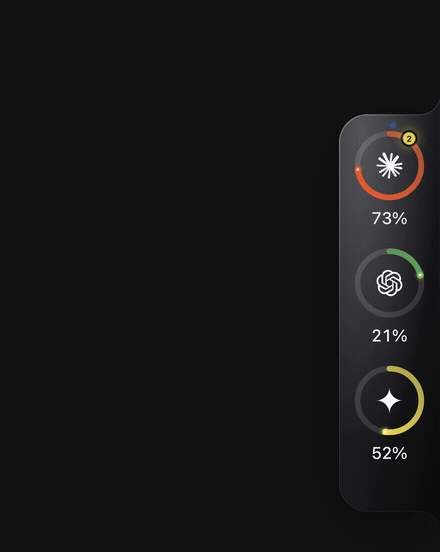

# BuddyUsage

**Website & install guide:** https://smtthese.github.io/BuddyUsage/

<p align="center">
  
</p>

A small island, docked to the edge of your screen, that shows how much
of your **Claude**, **ChatGPT / Codex**, **Gemini**, **Cursor** and **GitHub Copilot** plan you've used —
without alt-tabbing into each provider's website. It also watches the
**claude**, **codex** and **gemini** sessions running on your machine: see
which project each one is in, stop one, nudge it, get told when one needs
you, guard your limits, and do all of that from your phone.

One ring per assistant, coloured by how close you are to the limit. Hover a
ring for the detailed breakdown (session limit, weekly limit, when each
resets, and whether your current pace makes it to the reset). Right-click
for sign-in, refresh, activity, dashboard, settings.

**At a glance:** live gauges for five assistants · a pace line that says
when a window will run dry · notifications before you hit a limit ·
[Activity](#activity-where-your-week-went): tokens by project and model,
read from your own machine · [agent control](#agent-control): see, stop,
nudge and guard the CLI sessions spending those limits, from your desk or
your phone.

## Install

Builds ship for **macOS** (Apple Silicon + Intel), **Windows** (x64 + ARM64)
and **Linux** (x64 + ARM64). BuddyUsage is open source (MIT) and its builds
are not notarized with a paid Apple Developer ID, so pick the path that suits
you:

### macOS

Two routes. The first has no security prompt at all; the second has one,
once.

**1. Installer script — nothing to click through:**

```bash
curl -fsSL https://raw.githubusercontent.com/SmtTheSE/BuddyUsage/main/install.sh | bash
```

It downloads the right build, installs it to `/Applications` and opens it.
Because the download does not come through a browser, macOS never flags
it.

**2. DMG — one prompt, the first time:**
[Apple Silicon](https://github.com/SmtTheSE/BuddyUsage/releases/latest/download/BuddyUsage-arm64.dmg) ·
[Intel](https://github.com/SmtTheSE/BuddyUsage/releases/latest/download/BuddyUsage-x64.dmg).
Drag to Applications, double-click, and when macOS says it cannot verify
the developer: **System Settings → Privacy & Security → Open Anyway →
confirm**. After that the app clears the flag on itself and every later
version arrives through the in-app updater, which is not a browser
download, so the prompt never comes back.

Homebrew works too, with the same one-time prompt (Homebrew 7 removed its
no-quarantine option):

```bash
brew tap SmtTheSE/buddyusage https://github.com/SmtTheSE/BuddyUsage
brew install --cask buddyusage
```

### Windows

[x64 installer](https://github.com/SmtTheSE/BuddyUsage/releases/latest/download/BuddyUsage-x64.exe) ·
[ARM64 installer](https://github.com/SmtTheSE/BuddyUsage/releases/latest/download/BuddyUsage-arm64.exe),
or in PowerShell:

```powershell
irm https://raw.githubusercontent.com/SmtTheSE/BuddyUsage/main/install.ps1 | iex
```

SmartScreen may show *"Windows protected your PC"* → **More info → Run
anyway** (once).

### Linux

[x86_64 AppImage](https://github.com/SmtTheSE/BuddyUsage/releases/latest/download/BuddyUsage-x86_64.AppImage) ·
[ARM64 AppImage](https://github.com/SmtTheSE/BuddyUsage/releases/latest/download/BuddyUsage-arm64.AppImage),
or `curl -fsSL …/install.sh | bash` as above. Make it executable and run.

### Why the macOS prompt exists

Apple skips the warning only for apps signed with a **paid** Developer ID
and notarized by Apple. BuddyUsage does not have one, so Gatekeeper treats
a browser download as unidentified. There is no free workaround for that
specific path: Homebrew 7 removed `--no-quarantine`, and `.pkg` installers
need a paid certificate too.

What there is instead:

- the installer script, which does not download through a browser and so
  is never flagged;
- one approval for the DMG route, after which the app clears the flag on
  its own bundle and updates install in place, so it does not recur;
- published SHA-256 checksums and a signed build-provenance attestation,
  so you can verify what you downloaded without trusting Apple's stamp:
  `gh attestation verify BuddyUsage-arm64.dmg --repo SmtTheSE/BuddyUsage`.

If someone donates or sponsors a Developer ID, adding five repository
secrets turns notarization on for the next release with no code change
([docs/DISTRIBUTION.md](docs/DISTRIBUTION.md)). For Windows,
[SignPath Foundation](https://signpath.org/foundation) signs open-source
projects for free and the workflow already accepts the certificate.

**CLI** (reads the same data the app collects, works even when the app isn't running):

```bash
npm install -g github:SmtTheSE/BuddyUsage
buddyusage                    # usage table for every provider
buddyusage --json             # machine-readable
buddyusage activity --days=7  # tokens by project and model
buddyusage install            # download + install the latest release
buddyusage open               # launch the app
```

## First run

A short walkthrough opens the first time: pick the assistants you use,
sign in to each one (a real browser window on the provider's own page),
and a note on where the island lives. Skippable, and everything in it is
in Settings afterwards.

After that: click a ring → **Sign in** (or use the menu-bar / system-tray icon → Sign
in). A real browser window opens on that provider's own login page.
Sessions are kept in an isolated, persistent partition per provider, so you
do this once. On Windows the icon may sit behind the `^` overflow arrow next
to the clock; drag it onto the taskbar to keep it visible.

Drag the island anywhere — it snaps to the nearest screen edge and remembers
the spot. Hover it for the `›` handle to collapse it into a slim tab, or
turn on **Hide the island** to live in the menu bar alone.

## What each plan can show

BuddyUsage reads exactly what each provider publishes, so free plans see
honest states rather than errors:

| Provider | Paid plans | Free plan |
| --- | --- | --- |
| **Claude** (claude.ai → Settings → Usage) | Current session + weekly limits with reset times | Anthropic publishes no percentages; the ring shows **Free** and the card explains — the app tells you when you hit the limit |
| **ChatGPT** (chatgpt.com → Codex → Usage) | Codex 5-hour + weekly limits, read from OpenAI's own usage endpoint — the exact `used_percent` and reset timestamps the Codex CLI's `/status` shows (ChatGPT chat itself has no meter on any plan) | Same note; Codex limits appear on plans that include Codex |
| **Gemini** (gemini.google.com → Settings → Usage limits) | Current usage + weekly limit with resets; the plan badge only appears when the page names the plan | **Real gauges** — Google shows the panel for free accounts too (badge: Free). Flash-Lite chats barely move it; Pro/Thinking models and the Gemini CLI do |
| **Cursor** (cursor.com → Dashboard → Usage) · off by default | Included usage per model pool in dollars, monthly reset | Hobby plan shows included usage once used |
| **GitHub Copilot** (github.com → Settings → Billing → Metered usage) · off by default | AI Credits used of included (legacy plans: premium requests), monthly reset | Copilot Free shows metered usage once there is any |
| **Windsurf** · off by default | Prompt and flow credits against the monthly pool | Free tier reports its smaller pool the same way |
| **OpenRouter** · off by default | Credits used this month | Pay as you go, so a balance only appears once credits are bought |
| **Anthropic API** / **OpenAI API** · off by default | Month-to-date spend against the organisation's limit | No percentage until a budget is configured |

## Agent control

Everything here is local: processes and files on your own machine, no
cloud, nothing leaves the computer.

| Feature | What it does |
| --- | --- |
| **Live presence** | Each ring shows a breathing dot while a `claude` / `codex` / `gemini` **command-line** session is running on this computer (a count when there are several). The card lists every session with its project and how long it has run; the block is hidden when nothing is running. Browser chats are not sessions — the app cannot reach into a tab. |
| **Stop** | Interrupts a session the way Ctrl-C would (`SIGINT`), so the CLI saves the conversation and exits; it can be resumed later with `claude --resume`, `codex resume`, `gemini --resume`. Escalates to a hard kill if it does not go. On Windows both are a hard stop (the OS has no cross-process Ctrl-C); the conversation is still on disk. |
| **Jump** | Brings the terminal app hosting that session to the front. |
| **Nudge** | A one-line message to the latest conversation of that provider, sent headlessly (`claude -p --resume <id>`, `codex exec resume <id>`, `gemini --resume latest -p`) in the session's own project directory; the reply shows inline and lands in the agent's transcript too. Best used when the session is idle or waiting. |
| **Waiting-for-you alerts** | Settings → install a hook per CLI. Claude Code (`~/.claude/settings.json`: Notification, Stop, UserPromptSubmit), Gemini CLI (`~/.gemini/settings.json`: Notification, AfterAgent, BeforeAgent) and Codex (`notify` in `~/.codex/config.toml`) then call BuddyUsage the moment a session needs a permission click, goes idle or finishes. The ring flags it; permission/idle also raise a system notification whose click jumps to the terminal. Remove restores the file exactly. |
| **Limit guard** | "Pause my agents when Claude passes 90%." When a provider's main limit crosses the line, its running sessions are stopped and remembered; a notification and the card offer **Resume** after the reset, which reopens each one in a fresh terminal. New sessions started while over the line are stopped as well. Off by default. |
| **Phone remote** | Settings → Phone remote shows a QR code. The page (served by the app on your Wi‑Fi, secret in the URL, nothing to install) shows the rings, the running sessions with Stop, and the nudge box. Works from anywhere over Tailscale or any VPN into the machine. |
| **Copy diagnostics** | Right-click a ring: the parsed reading and its source, for bug reports. |

The hook listener always runs on `127.0.0.1:47831` (next free port if taken;
installed hooks are re-pointed automatically). It binds to the network only
while Phone remote is on. Every URL carries the secret; without it the
server answers 404. **New secret** in Settings revokes old links.

## Your agents can read their own budget (MCP)

BuddyUsage runs as an MCP server, so the assistants themselves can check
how much is left before starting something expensive:

```bash
claude mcp add buddyusage -- buddyusage mcp     # Claude Code
codex mcp add buddyusage -- buddyusage mcp      # Codex CLI
```

Three read-only tools, all answered from the local cache:

| Tool | Answers |
| --- | --- |
| `get_usage` | Every connected assistant: percentage per limit window, reset times, plan |
| `get_activity` | Tokens by project and model for the last N days |
| `check_budget` | One verdict — `ok`, `tight` or `exhausted` — with the limiting window and what to do |

## Activity: where your week went

No provider tells you *which project* or *which model* spent your limit.
BuddyUsage reads the transcripts Claude Code and Codex already write on
this machine (`~/.claude/projects`, `~/.codex/sessions`) and shows tokens
by **project**, by **model**, by **day** — in a window from the card's
**Activity** link, the tray, or Settings. Nothing is uploaded, no account
or API key is involved, and the scan is incremental (a gigabyte of logs
takes a couple of seconds once, then milliseconds).

```bash
buddyusage activity --days=7        # same report in the terminal
buddyusage activity --days=30 --json
```

Gemini CLI does not record per-turn token counts yet, so it is absent from
the breakdown; its gauge still works.

## Knowing before you hit the wall

| | |
| --- | --- |
| **Pace line** | Each card says what the percentage can't: *"At ~12%/h this empties in 1 h 20 m, before it resets"* or *"At this pace, about 38% left at reset."* Derived from the polling the app already does, and shown only when there is enough signal to mean something. |
| **Model hint** | When one window is tight and a sibling is not — Opus 92%, Sonnet 31% — the card says so, because switching model is the cheapest saving there is. |
| **Alerts** | A notification the first time a limit passes each mark you pick (50 / 80 / 95 / 100%), once per window. Optional extras: one heads-up when the current pace would exhaust a window early, and one when a limit resets. |

## Never a guessed number

A wrong percentage is worse than no percentage, so the app is strict about
what reaches the ring:

- **ChatGPT** is read from the JSON endpoint behind the Codex usage page
  (`/backend-api/wham/usage`, the same call the Codex CLI makes), so the
  value is OpenAI's own `used_percent`, not a number scraped from text.
- **Every other provider** is re-read until the page is fully rendered:
  every expected limit window has a figure and two consecutive reads
  agree. A half-loaded page is never accepted.
- Only a **labelled** meter counts ("Current session · 37% used"). A bare
  percentage somewhere on the page (a chart axis, a discount) is ignored.
- Pages that count down ("84% left") are inverted correctly.
- If a page can't be read, the ring keeps the last good reading and the
  card says **Stale** rather than showing a fresh but wrong figure.

If a number still looks wrong, right-click that ring → **Copy diagnostics**
and paste the result into an issue. It contains the parsed reading and the
exact text or JSON it was parsed from, so the fix is usually a one-liner.
To see what the hidden window itself saw, launch with
`BUDDYUSAGE_DEBUG_SHOTS=1`: a screenshot per provider is written to
`<userData>/debug/` after every read (macOS: `~/Library/Application
Support/BuddyUsage/debug/`).

## Updates

BuddyUsage checks GitHub Releases on launch and every few hours. When a
new version exists you get a system notification, a blue dot on the island,
an **Update** button in every card, and **Update to x.y.z…** in the menu-bar
menu. One click downloads the right build for your machine and installs it
in place — the app restarts on the new version. No terminal, no hunting for
files; a **Download ↗** link to the release page is always there as a fallback.

This is built in rather than using Electron's stock auto-updater because
that one refuses to install on macOS without a Developer ID signature.

## Staying current without clicking Refresh

The gauges are meant to be glanced at, not poked. Every sync path funnels
into one deduplicated fetch per provider, so nothing ever double-hits a
site:

| Trigger | When |
| --- | --- |
| Poll | Every 3 min by default (1–60 in Settings), staggered per provider |
| You use a tool | The CLI's local session dir changes (`~/.claude/projects`, `~/.codex/sessions`, `~/.gemini/tmp`) → re-sync ~15 s later, at most once a minute while active |
| A limit resets | "Resets in 51 min" / "at 7:07 PM" / "Sep 22 at 11:07 PM" is parsed and a re-sync is scheduled just after, so the ring drops to 0% on its own |
| Wake from sleep | Everything re-syncs a few seconds after resume |
| You open a card | If its data is older than 45 s it quietly refreshes, showing "Updating…" inline |

## Privacy, and verifying a download

Nothing leaves your machine: no server, no telemetry, no account. Sessions
live in an isolated store per provider and are sent only to that
provider's own domain. The full statement, including how the phone remote
and the CLI hooks are bounded, is in [SECURITY.md](SECURITY.md).

Every release publishes `SHA256SUMS.txt` and a signed build-provenance
attestation from the GitHub workflow that produced it:

```bash
gh attestation verify BuddyUsage-arm64.dmg --repo SmtTheSE/BuddyUsage
shasum -a 256 -c SHA256SUMS.txt --ignore-missing
```

Packaging and signing plans (Apple Developer ID, SignPath for Windows,
winget, Scoop, Homebrew core) are in [docs/DISTRIBUTION.md](docs/DISTRIBUTION.md).

## Why it works this way

CLI coding assistants don't expose a unified usage API. The only place to
check "how much of my limit is left" is each provider's account **Settings →
Usage** page. BuddyUsage keeps a hidden, logged-in browser window per
provider, reads that page on a schedule, and renders the numbers.

## Architecture

- **Island window** (`src/main/windows/islandWindow.ts`): a frameless,
  transparent, always-on-top, non-activating panel docked to the screen
  edge. Only the island and its popover catch the mouse; empty space passes
  clicks through to whatever is underneath.
- **Provider plugins** (`src/main/providers/`): every assistant implements
  `ProviderDefinition` (URLs, session partition, expected limit windows,
  login check, extract, parse). `registry.ts` is the single list —
  **adding an assistant is one file + one line**.
- **Parsing** (`parseHeuristics.ts`): matches on the *words* a usage page
  uses ("Current session", "Resets in 51 min", "73% used") rather than CSS
  selectors, because wording survives redesigns far better than markup.
  A provider can instead return structured data (ChatGPT reads OpenAI's
  usage endpoint from inside the signed-in window) and mark the reading
  `complete`. Fully unit-tested against page fixtures and captured
  responses (`npm test`).
- **Scraping** (`src/main/scraping/`): one hidden persistent-session window
  per provider, staggered polling, a hard per-fetch timeout, and a
  read-until-stable loop (a page is accepted only once every expected
  window has a value and two reads agree), and a never-throws contract —
  every failure becomes a well-formed snapshot (`ok` / `stale` / `error` /
  `logged_out` / `no_meter`) that keeps the last good numbers on screen.
- **Persistence** (`src/main/store/`): schema-versioned settings and usage
  cache via `electron-store`. The CLI reads the cache file directly.
- **IPC**: one channel registry (`src/shared/types.ts`), one typed
  `window.buddyUsage` bridge (`src/preload/index.ts`); the renderer never
  touches Node or Electron.

## Roadmap

Where this is going — agent control (live presence, a Stop button, an
auto-stop limit guard, "waiting for you" badges, a nudge box, a phone
kill switch), budgeting (burn rate, daily pace, per-project usage) and
more sources — with effort and precision notes for each:
[docs/ROADMAP.md](docs/ROADMAP.md).

## Develop

```bash
npm install
npm run dev          # launches the app with hot reload
npm test             # parser unit tests
npm run typecheck
npm run build:mac    # unsigned .dmg + .zip in release/ (--win / --linux likewise)
```

Open http://localhost:5173/#island in a normal browser while `npm run dev`
is running to iterate on the UI with mock data (no Electron needed).

### Releasing

Push a tag and GitHub Actions builds macOS, Windows and Linux (x64 + ARM64)
and attaches them to a GitHub Release, which is what the install links above
point at. The release page gets plain-language install steps from
`.github/release-notes.md`.

```bash
npm version patch   # bumps package.json + creates the tag
git push --follow-tags
```

### Signed releases (no security prompts)

Apple and Microsoft only let an app open with zero warnings if it's signed
by a registered developer — there is no workaround for end users. The
pipeline is already wired for it; add these repository secrets
(**Settings → Secrets and variables → Actions**) and the next tagged release
is signed and notarized automatically:

| Secret | What it is |
| --- | --- |
| `CSC_LINK` | Base64 of a **Developer ID Application** `.p12` exported from Keychain (`base64 -i cert.p12 \| pbcopy`) — needs an [Apple Developer Program](https://developer.apple.com/programs/) membership |
| `CSC_KEY_PASSWORD` | The `.p12` password |
| `APPLE_ID` | The Apple ID of the developer account |
| `APPLE_APP_SPECIFIC_PASSWORD` | An [app-specific password](https://support.apple.com/102654) for that Apple ID |
| `APPLE_TEAM_ID` | The 10-character team ID from the developer account |
| `WIN_CSC_LINK` / `WIN_CSC_KEY_PASSWORD` | Base64 `.pfx` code-signing certificate + password (Windows, optional) |

Without these, macOS builds are ad-hoc signed (valid but unverified → one
"Open Anyway" prompt) and Windows builds are unsigned (one SmartScreen prompt).

### Adding a provider

1. Create `src/main/providers/<id>.ts` — copy `claude.ts`, set the URLs,
   session partition and the labels of the limit windows its page shows.
2. Add it to `src/main/providers/registry.ts`.
3. (Optional) add a mark in `src/renderer/src/components/ProviderIcon.tsx`;
   otherwise the first letter is shown.

## Known limitations

- **Scraping is brittle by nature** (ChatGPT excepted, which uses a JSON
  endpoint). If a provider rewords its usage page, parsing fails safe: the
  ring keeps the last good reading, the card says Stale, and right-click →
  **Copy diagnostics** (or `buddyusage --json`) gives the exact text so
  fixing the label list is quick.
- **Security prompt on first launch** until the release is signed — see
  [Signed releases](#signed-releases-no-security-prompts).
- **Best tested on macOS.** Windows and Linux builds ship from the same
  code; the island docks to the edge of the primary display's work area on
  every platform, but Linux transparency/click-through depends on the
  compositor (see Install).
